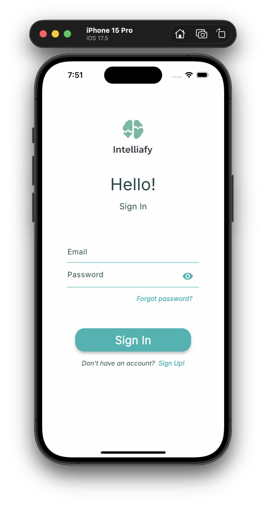
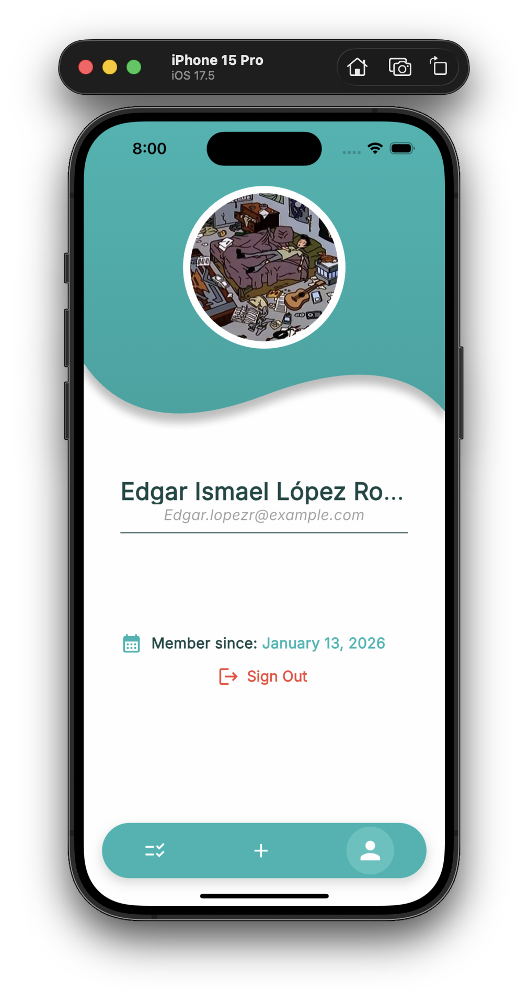
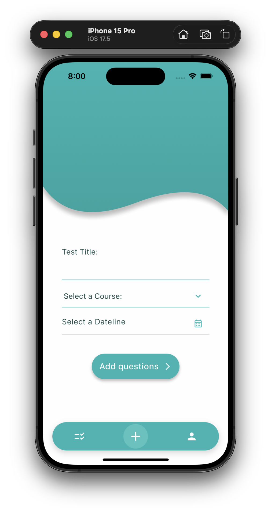
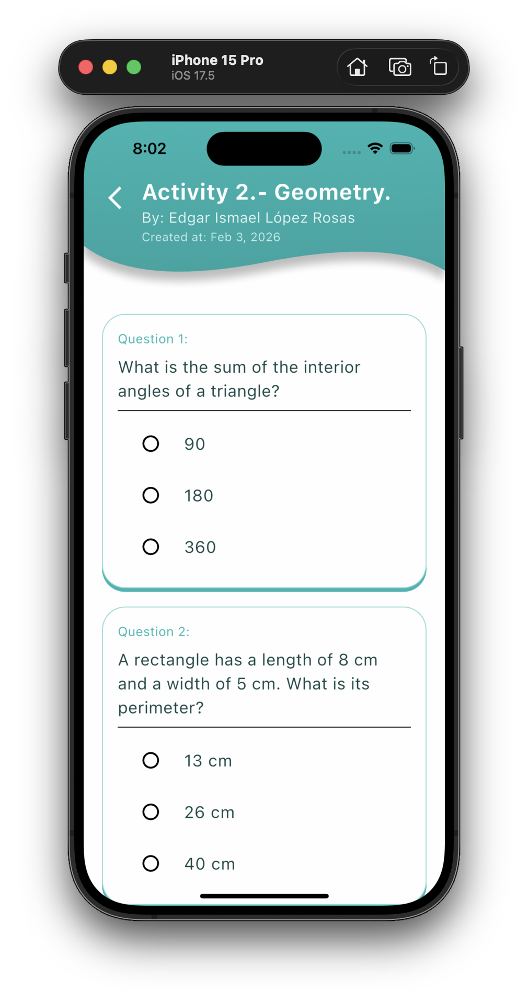
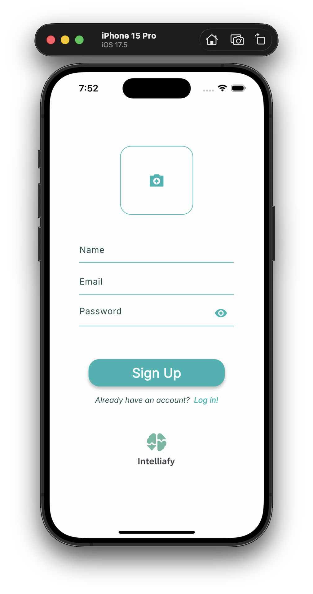
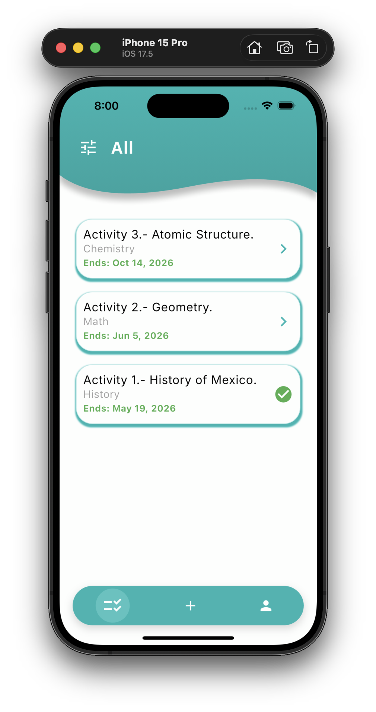
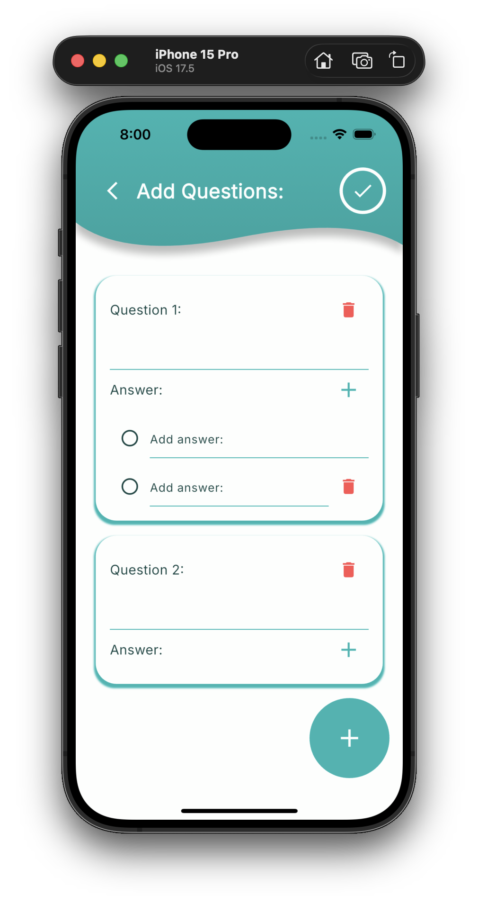
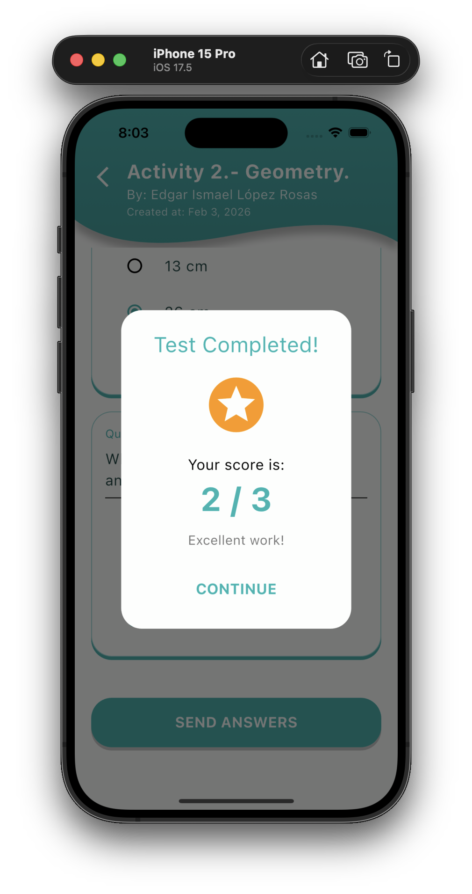

# Intelliafy App 

Intelliafy is a modern Flutter application designed for educational management, allowing users to create, manage, and take recruitment tests or academic exams in real-time.

## Features

* **Real-time Database:** Powered by Cloud Firestore for instant test updates.
* **Authentication:** Secure login and signup using Firebase Auth with profile image upload to Firebase Storage.
* **Dynamic Filtering:** Filter tests by course name using a custom-built popup menu.
* **Test Management:** * Create tests with custom deadlines.
    * Upload questions with multiple-choice answers.
    * Delete tests (restricted to the author).
* **Student Dashboard:** Track completed tests with status indicators (Checkmarks/Arrows).
* **Modern UI:**
    * Custom curved headers and floating navigation bar.
    * Adaptive text scaling for long titles.
    * Reactive splash screen.

## Tech Stack

* **Framework:** [Flutter](https://flutter.dev/)
* **State Management:** [Provider](https://pub.dev/packages/provider)
* **Backend:** [Firebase](https://firebase.google.com/) (Auth, Firestore, Storage)
* **Image Handling:** Image Picker & Image Cropper
* **Navigation:** Custom Barrel Pattern for optimized imports.

## Project Structure

The project follows a modular architecture for scalability:
```text
lib/
 ├── config/       # Theme and app constants
 ├── providers/    # State management (AuthNotifier)
 ├── screens/      # App screens grouped by flow (Auth, Tests)
 ├── services/     # Firebase and external API logic
 ├── widgets/      # Reusable UI components (Common, Profile, etc.)
 └── exports.dart  # Global barrel file for simplified imports
```

## Getting Started 

**Prerequisites** 

* **Flutter SDK installed on your machine** 
* **A Firebase project configured via Firebase Console**

**Installation** 

* **1. Clone the repository:**
    * git clone [https://github.com/EdgarLopezMX/Intelliafy.git](https://github.com/your-username/intelliafy_app.git)  
* **2. Install dependencies:**
    * flutter pub get
* **3. Firebase Setup:**
    * Download google-services.json and place it in android/app/.
    * Download GoogleService-Info.plist and place it in ios/Runner/.
* **4. Run the application:**
    * flutter run

## Preview

| Login & Signup | Profile & List Test | Test Management | Results |
| :---: | :---: | :---: | :---: |
|  |  |  |  |
|  |  |  |  |